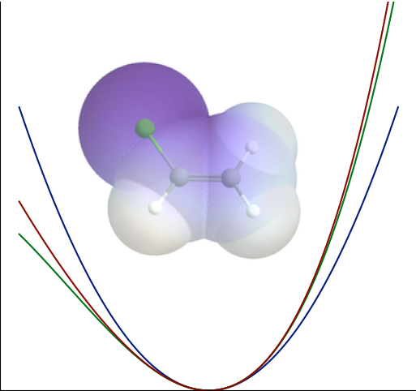

# Python Potential Registry

The python chemical potential registry is an umbrella for a set of repositories for providing potential modules that are designed to be _immediately useable_ in python.
Each potential lives in an independent repository and can be downloaded from the appropriate GitHub release.
Any necessary compilation/build steps should happen automatically behind the scenes, or if necessary individual releases targeting different architectures should be provided.